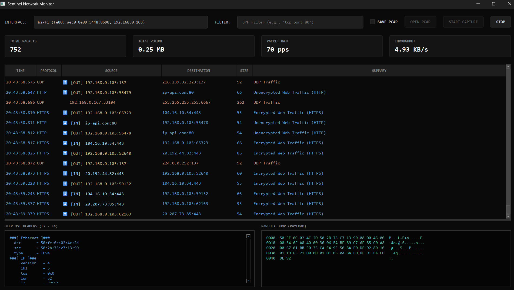

# Sentinel Network Monitor

A highly cinematic, low-level packet capture and analysis tool designed to bridge the gap between deep networking forensics and stunning visualizations. 



## Features
- **Cinematic Packet Stream**: A blazing-fast, terminal-style matrix showing packets flowing in and out of your machine in real-time.
- **Deep OSI Inspection**: Select any packet to instantly peel back the curtain and view its Layer 2 - Layer 4 structural headers and the literal raw Hexadecimal payload.
- **Humanized Context**: Automatically resolves IP addresses to Domain Names (e.g. `google.com`), performs Geo-Location (e.g. `United States`), and translates raw ports to plain English (e.g. "Encrypted Web Traffic").
- **Time-Travel Forensics**: Capture live packets directly from your Wi-Fi card, or open offline `.pcap` files and watch them replay through the cinematic dashboard.

## Prerequisites

On Windows, you must install **Npcap** or **WinPcap** for the packet capture engine to work.
- Download Npcap here: [https://npcap.com/](https://npcap.com/)

## Installation

1. Clone or download this repository.
2. Install the required Python dependencies:

```bash
pip install -r requirements.txt
```

## Usage

Run the main application from your terminal:

```bash
python main.py
```

### Live Capture
- Select your network interface from the top dropdown.
- (Optional) Enter a BPF Filter (e.g., `tcp port 443`) to only capture specific traffic.
- (Optional) Check "SAVE PCAP" to automatically log the session to a file.
- Click **START CAPTURE** to begin the matrix stream.
- Click on any packet row in the table to view its raw Hex Dump and OSI Headers at the bottom of the screen.

### Offline Analysis
- Click **OPEN PCAP**.
- Select a previously saved `.pcap` or `.pcapng` file.
- The packets will instantly stream into the dashboard for deep inspection, exactly as if they were live traffic.
